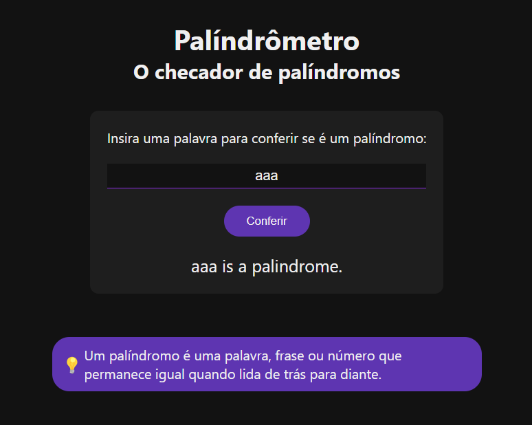

# Palíndrômetro

Um verificador de palíndromos simples e elegante desenvolvido com HTML, CSS e JavaScript.

## Sobre o projeto

O Palíndrômetro é uma aplicação web que permite ao usuário verificar se uma palavra ou frase é um palíndromo - texto que, quando lido ao contrário, mantém o mesmo significado.

### Funcionalidades

- Interface intuitiva com design moderno em tema escuro
- Verificação instantânea de palíndromos
- Formatação automática do texto (remove espaços, pontuação e diferencia maiúsculas/minúsculas)
- Feedback visual imediato

### Tecnologias utilizadas

- HTML5
- CSS3 com variáveis CSS para themeing
- JavaScript vanilla
- Design responsivo

## Demonstração

## Como usar

1. Digite uma palavra ou frase no campo de texto
2. Clique no botão "Conferir"
3. O resultado aparecerá logo abaixo, informando se é um palíndromo ou não

## Exemplos de palíndromos

- Ana
- Ovo
- Radar
- Osso
- "A man, a plan, a canal: Panama"
- "Able was I ere I saw Elba"
